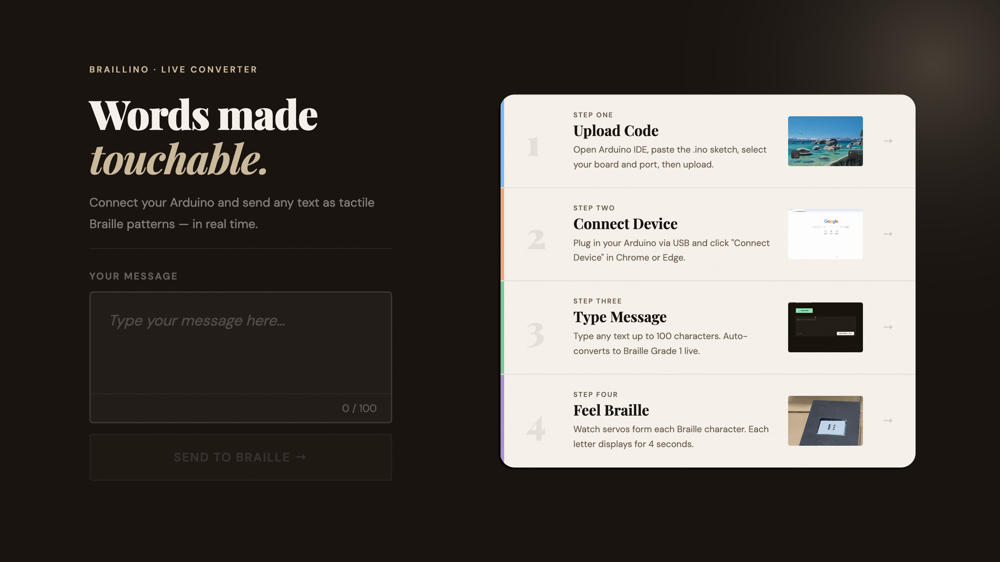

[README.md](https://github.com/user-attachments/files/25417463/README.md)
# Braillino — Words Made Touchable

> An Arduino-powered Braille e-reader that converts any text into tactile Braille patterns — in real time, through the browser.



---

## What is Braillino?

Braillino is a student-built assistive technology project that bridges the gap between digital text and physical touch. Type any message into the web interface, and two servo motors physically form each Braille character — one letter at a time — so anyone can feel the words.

Built as part of our Practical Research, Capstone, and Inquiries, Immersion & Investigation subjects, Braillino was inspired by a classmate whose eyesight worsened significantly during the pandemic — and who told us, *"I could not read without it, and I don't know what I would do without it."*

---

## Features

- **Live Braille conversion** — Type up to 100 characters and see a real-time Braille dot preview in the browser
- **Web Serial API** — Connects directly to your Arduino via USB, no drivers or apps needed
- **Auto-reconnect** — Remembers your device across page navigation
- **Supports A–Z, 0–9, and punctuation** — Full Braille Grade 1 character set
- **Split-view interface** — Drag to resize the converter and how-it-works panels, iPad-style
- **Step-by-step guide** — Built-in walkthrough with video demos for each setup step
- **Team & About page** — Auto-cycling team spotlight slideshow

---

## Hardware Requirements

| Component | Details |
|---|---|
| Arduino | Uno or Nano |
| Servo Motors | 2× SG90 or similar |
| Connections | Left servo → Pin 10 · Right servo → Pin 9 |
| Cable | USB (for both upload and serial communication) |

---

## Software Requirements

- [Arduino IDE](https://www.arduino.cc/en/software) — for uploading the sketch
- **Chrome or Edge** (desktop) — required for Web Serial API support
- Safari and Firefox are **not** supported

---

## Getting Started

### 1. Upload the Arduino Code
1. Download `braillino_code.ino` from this repository
2. Open it in Arduino IDE
3. Go to **Tools → Board** and select your board (Uno or Nano)
4. Go to **Tools → Port** and select the correct port
5. Click **Upload** and wait for *"Done uploading"*

### 2. Connect the Device
1. Keep your Arduino plugged in via USB
2. Open the Braillino website in **Chrome or Edge**
3. Click **Connect Device** and then **Scan Ports**
4. Select your Arduino from the list
5. Click **Connect** — the status dot turns green ✓

### 3. Type & Send
1. Type any message in the text area (up to 100 characters)
2. Watch the live Braille dot preview update as you type
3. Click **Send to Braille →** to transmit to the Arduino

### 4. Feel the Braille
- Each character displays for **4 seconds**
- The same letter appearing twice gets a 400ms pause between them
- Left servo controls dots 1–3 · Right servo controls dots 4–6

---

## Project Structure

```
braillino/
├── index.html              # Main converter page
├── resources.html          # Downloads & FAQ
├── about.html              # Team & story
├── braillino_code.ino      # Arduino sketch
├── braillinologooo.png     # Logo
├── apple-touch-icon.png    # Favicon
├── demo1.mp4               # Step 1 demo video
├── demo2.mp4               # Step 2 demo video
├── demo3.mp4               # Step 3 demo video
├── step4braillino.mp4      # Step 4 demo video
└── [team photo files]      # Spotlight images for About page
```

---

## Braille Character Support

Supports full **Braille Grade 1** encoding:

- Letters: `A` – `Z`
- Numbers: `0` – `9`
- Punctuation: `. , ? ! ; : - ' " ( ) / @ #`
- Space

Dots are arranged in a standard 2×3 Braille cell. Text is automatically converted to uppercase before transmission.

---

## Troubleshooting

**Arduino won't connect?**
Make sure you're using Chrome or Edge on desktop. Verify the sketch was uploaded successfully before trying to connect.

**Servos not moving correctly?**
Double-check pin connections: left servo on **pin 10**, right servo on **pin 9**. Ensure your power supply provides enough current.

**Want to change display speed?**
In the `.ino` file, find `DISPLAY_TIME = 4000` and change the value in milliseconds.

**No ports showing up after scanning?**
Unplug and replug the Arduino, then try scanning again.

---

## The Team

| Name | Role |
|---|---|
| Daniel Basto | Team Leader |
| Franchesca Asuncion | Asst. Team Leader & Lead Developer |
| Ephraim Serenio | Lead Developer & Web Editor |
| Zhen Gomba | Prototype Development & Documentation |
| Marc Mazaredo | Prototype Development & Documentation |
| Keisha Reyes | Prototype Development & Documentation |
| Mharc Mendoza | Supporting Contributor |

---

## Live Site

🌐 [nonaquo.github.io/texttobraille](https://nonaquo.github.io/texttobraille/)

---

*© 2026 Braillino — Making text accessible through touch.*
